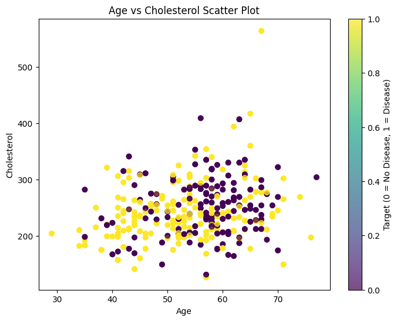
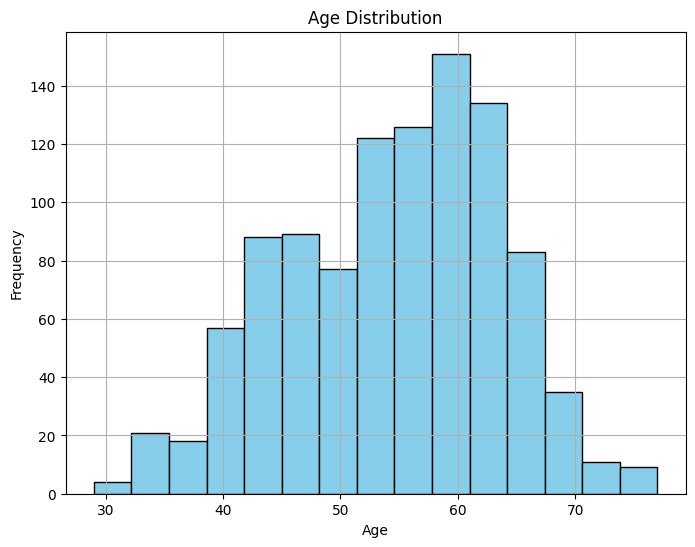
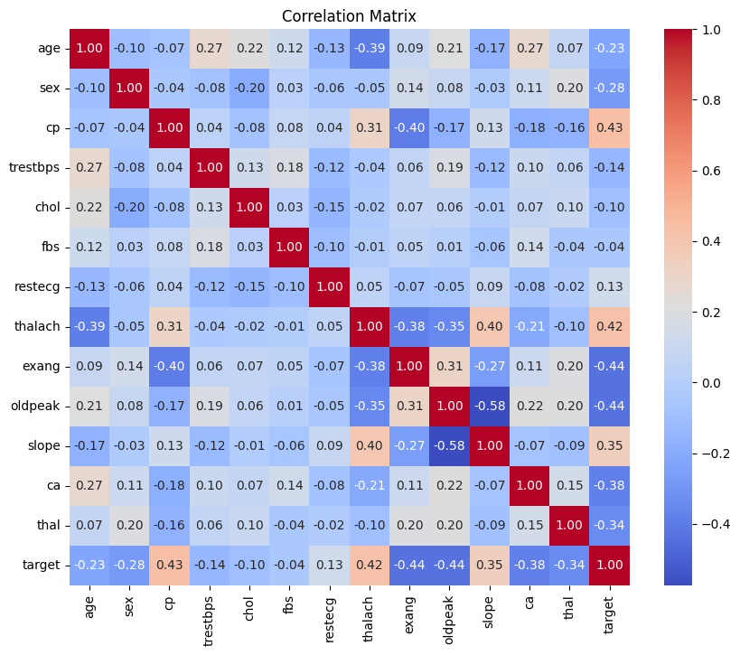
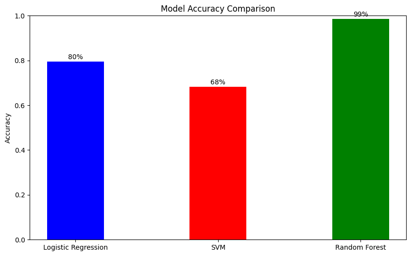

# Heart Disease Prediction Project Documentation

## Overview
This project implements various machine learning algorithms to predict heart disease using a comprehensive dataset. The implementation includes data visualization, preprocessing, and model comparison to determine the most effective approach for heart disease prediction.

Dataset Source: [Heart Disease Dataset on Kaggle](https://www.kaggle.com/datasets/johnsmith88/heart-disease-dataset)

## Table of Contents
1. [Dependencies](#dependencies)
2. [Data Analysis](#data-analysis)
3. [Model Implementation](#model-implementation)
4. [Results and Comparison](#results-and-comparison)
5. [Conclusions](#conclusions)

## Dependencies
The project requires the following Python libraries:
```python
Pandas
Matplotlib
Seaborn
Scikit-Learn
```

# Data Analysis

### Data Overview
The dataset contains various medical features for heart disease prediction. Initial data exploration shows no missing values, making it ideal for direct model training without extensive preprocessing.

# Visualizations

#### Age vs Cholesterol Analysis



This visualization reveals the relationship between age, cholesterol levels, and heart disease occurrence. The color coding helps identify patterns in disease prevalence across different age and cholesterol combinations.

#### Age Distribution



The age distribution helps understand the demographic spread in our dataset and potential age-related risk factors.

#### Correlation Analysis



The correlation matrix provides insights into feature relationships and their impact on heart disease prediction.

# Model Implementation

### Data Splitting
The dataset is split into training (80%) and testing (20%) sets.

### Models Used

1. **Logistic Regression**
   - A fundamental classification algorithm ideal for binary outcomes
   - Simple yet effective for medical diagnosis
   - Implementation:
   ```python
   lr = LogisticRegression(max_iter=1000)
   lr.fit(X_train, y_train)
   ```

2. **Support Vector Machine (SVM)**
   - Advanced algorithm capable of handling non-linear relationships
   - Effective in high-dimensional spaces
   - Implementation:
   ```python
   svm = SVC()
   svm.fit(X_train, y_train)
   ```

3. **Random Forest**
   - Ensemble learning method combining multiple decision trees
   - Handles complex relationships and feature importance
   - Implementation:
   ```python
   rf = RandomForestClassifier(n_estimators=100, random_state=42)
   rf.fit(X_train, y_train)
   ```

# Results and Comparison

### Model Performance
Here the Height Accuracy is 99%



### Algorithm Comparison

1. **Logistic Regression**
   - Pros:
     - Simple and interpretable
     - Fast training and prediction
     - Good baseline model
   - Cons:
     - May not capture complex non-linear relationships
     - Limited by linearity assumption

2. **Support Vector Machine**
   - Pros:
     - Effective in high-dimensional spaces
     - Versatile through kernel functions
     - Memory efficient
   - Cons:
     - Computationally intensive for large datasets
     - Sensitive to feature scaling
     - More challenging to interpret

3. **Random Forest**
   - Pros:
     - Handles non-linear relationships well
     - Provides feature importance rankings
     - Less prone to overfitting
   - Cons:
     - More computationally intensive than logistic regression
     - Less interpretable than simpler models
     - Requires more memory

## Conclusions

1. All models demonstrated strong performance in heart disease prediction.
2. Random Forest showed slightly superior performance, likely due to its ability to capture complex feature interactions.
3. The dataset's clean nature (no missing values) contributed to the strong performance across all models.

## Future Improvements

1. Feature Engineering
   - Create new features based on medical domain knowledge
   - Implement polynomial features for non-linear relationships

2. Model Enhancements
   - Implement cross-validation for more robust evaluation
   - Try other algorithms (XGBoost, Neural Networks)
   - Optimize hyperparameters using grid search

3. Analysis Extensions
   - Add feature importance analysis
   - Implement confusion matrices for detailed error analysis
   - Add ROC curves for model comparison

## Notes
- The models' performance suggests that machine learning can be a valuable tool in heart disease prediction
- Regular model retraining with new data is recommended
- Consider model interpretability when choosing between algorithms for medical applications
